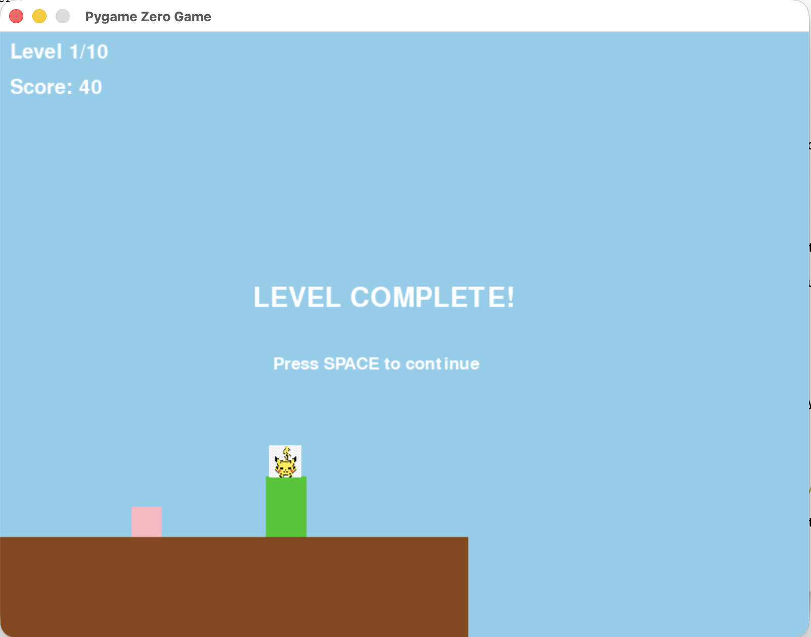

# pikachu-platformer

Sample Vibe-coded platformer on pygame-zero, runs on Raspberry Pi 4



## Gameplay

This is a simple Mario-like game in pygame-zero. The character motion can be controlled via WASD (or basically just A and D for left and right), or arrow keys for the same. Spacebar to jump.

The character is displayed as a Pikachu, but acts more like Mario. There are 10 levels that contain Mario-like platforms, but simple enough that there are no breakable bricks or coin blocks. Platform levels are procedurally generated with a fixed seed. 10 levels side-scrolling, and when Pikachu gets to the end the level is complete. The only enemies are walking Eevee characters who behave more like Goombas and can be stomped, but if Pikachu touches them from the side, must restart the level. Infinite lives.

## Requirements

This game is designed for Raspberry Pi 4+ with Raspberry Pi OS, but will run on any system that supports Python 3.7+ including macOS, Linux, and Windows.

- Python 3.7 or higher
- pygame-zero 1.2.1+
- pygame 2.1.0+

## Setup

1. Clone this repository:
```bash
git clone https://github.com/yourusername/pikachu-platformer.git
cd pikachu-platformer
```

2. Create a virtual environment (recommended):
```bash
python3 -m venv --system-site-packages my-venv
source my-venv/bin/activate  # On Windows: my-venv\Scripts\activate
```

3. Install dependencies:
```bash
pip install -r requirements.txt
```

## Running

To run the game:
```bash
python3 pikachu_platformer.py
```

Or using pgzrun directly:
```bash
pgzrun pikachu_platformer.py
```
